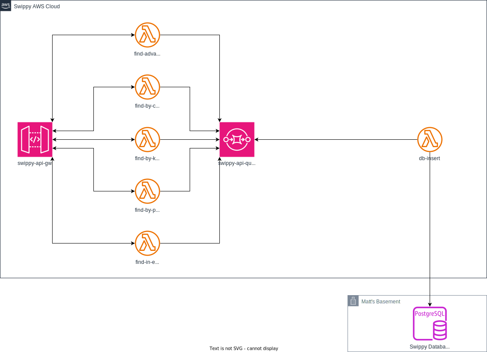

# Swippy API

Swippy API is a serverless application designed to interact with the [eBay Finding API](https://developer.ebay.com/api-docs/user-guides/static/finding-user-guide-landing.html) to perform various searches, retrieve information about items, and save item data to a database.

## Architecture



The API is architected with AWS API Gateway, Lambda, SQS, and PostgreSQL. The [OpenTofu](https://opentofu.org) configuration sets up the infrastructure for the Swippy API.

### Lambda Functions

Each Lambda function uses [Go](https://go.dev) for its implementation.

#### find-advanced

This Lambda function handles requests to the [findItemsAdvanced](https://developer.ebay.com/Devzone/finding/CallRef/findItemsAdvanced.html) eBay Finding API endpoint.

#### find-by-category

This Lambda function handles requests to the [findItemsByCategory](https://developer.ebay.com/Devzone/finding/CallRef/findItemsByCategory.html) eBay Finding API endpoint.

#### find-by-keywords

This Lambda function handles requests to the [findItemsByKeywords](https://developer.ebay.com/Devzone/finding/CallRef/findItemsByKeywords.html) eBay Finding API endpoint.

#### find-by-product

This Lambda function handles requests to the [findItemsByProduct](https://developer.ebay.com/Devzone/finding/CallRef/findItemsByProduct.html) eBay Finding API endpoint.

#### find-in-ebay-stores

This Lambda function handles requests to the [findItemsIneBayStores](https://developer.ebay.com/Devzone/finding/CallRef/findItemsIneBayStores.html) eBay Finding API endpoint.

#### db-insert

This Lambda function is triggered by the `swippy-api-queue` to insert eBay item data into the Swippy Database.

## Installation

### Prerequisites

- [OpenTofu](https://opentofu.org/docs/intro/install/)
- AWS credentials configured locally

### Usage

Clone this repository:

```sh
git@github.com:matthewdargan/swippy-api.git
```

Create a `terraform.tfvars` file at the root project directory with your specific values, including `ebay_app_id`, `swippy_db_url`, and optionally `aws_region` (defaults to us-east-1).

Build and zip the Lambda functions, and initialize and apply the OpenTofu configuration:

```sh
make apply
```

Follow the prompts to confirm the changes. Once you finish this process, AWS will provision the Swippy API infrastructure.

### Cleanup

To remove all provisioned resources, run the following command:

```sh
tofu destroy
```

Follow the prompts to confirm the destruction of the resources.
